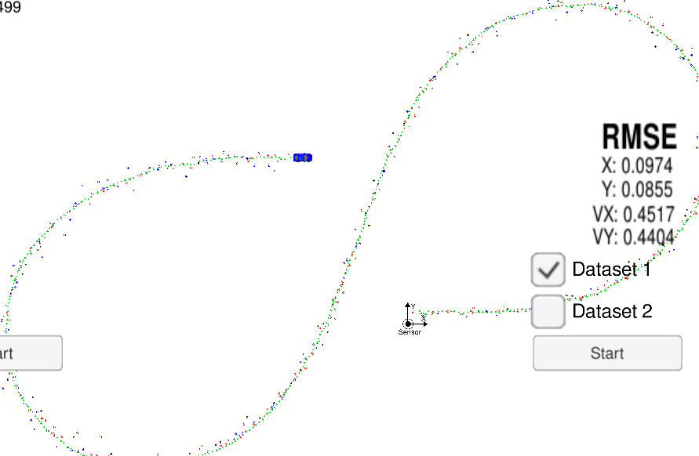
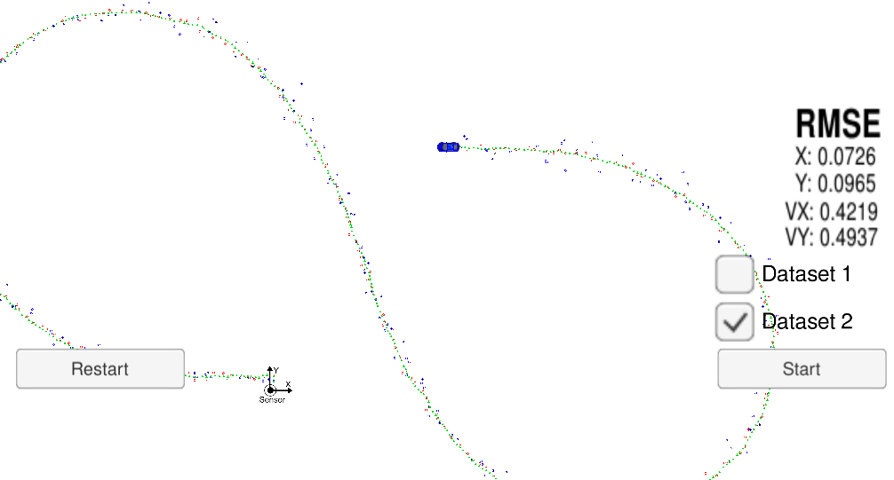

# Extended Kalman Filter Project 
Self-Driving Car Engineer Nanodegree Program

This project utilize a kalman filter to estimate the state of a moving object of interest with noisy lidar and radar measurements. This project obtains RMSE values that are lower than the tolerance outlined in the project rubric as shown in the next figures:

           

Here you can also find the Term 2 Simulator. This repository includes two files that can be used to set up and install [uWebSocketIO](https://github.com/uWebSockets/uWebSockets) for either Linux or Mac systems. For windows you can use either Docker, VMware, or even [Windows 10 Bash on Ubuntu](https://www.howtogeek.com/249966/how-to-install-and-use-the-linux-bash-shell-on-windows-10/) to install uWebSocketIO.

Once the install for uWebSocketIO is complete, the main program can be built and run by doing the following from the project top directory.

1. mkdir build
2. cd build
3. cmake ..
4. make
5. ./ExtendedKF

## Files

The programs that were written to accomplish the project are src/FusionEKF.cpp, src/FusionEKF.h, kalman_filter.cpp, kalman_filter.h, tools.cpp, and tools.h

In *FusionEKF.cpp* I have initialized the matrices for the EKF, including the covariance matrix *R* for each sensor (laser/radar) and measurement matrix for the laser.  The method *ProcessMeasurement* initilize the state vector with the first measurement, for the following readings I performed the prediction stage accordingly the elapsed time *dt*. This value is used to update the transition matrix *F*, then the noise covariance matrix *Q* is updated using *noise_ax* = 9 and *noise_ay* = 9.

The update stage is performed differently depending on the sensor modality, for the laser we use a Kalman Filter and for the radar an Extended Kalman Filter. For this last one we are required to calculate the jacobian matrix *Hj* which is implemented in *tools.cpp*

In *kalman_filter.cpp* you can find the method to perform the prediction step and two methods for the update. The update method is used to update the state by using Kalman filter equations (for the laser data). On the other hand, the UpdateEKF method update the state by using extended Kalman filter equations, in here the preduction is computed based on the sensor data, since the computation of an angle is involved in the process it's important to check for the max and min limits for this case [-pi +pi]. 

In *tools.cpp* we have two methods, one for the calculation of the RMSE and the Jacobian matrix used for the EKF (important note: check division by zero). 

In *main.cpp* we can find the main protocol for uWebSocketIO to communicate with the simulator.

*INPUT*: values provided by the simulator to the c++ program

["sensor_measurement"] => the measurement that the simulator observed (either lidar or radar)

*OUTPUT*: values provided by the c++ program to the simulator

["estimate_x"] <= kalman filter estimated position x

["estimate_y"] <= kalman filter estimated position y

[rmse_x"]

["rmse_y"]

["rmse_vx"]

["rmse_vy"]

---

## Other Important Dependencies

* cmake >= 3.5
  * All OSes: [click here for installation instructions](https://cmake.org/install/)
* make >= 4.1 (Linux, Mac), 3.81 (Windows)
  * Linux: make is installed by default on most Linux distros
  * Mac: [install Xcode command line tools to get make](https://developer.apple.com/xcode/features/)
  * Windows: [Click here for installation instructions](http://gnuwin32.sourceforge.net/packages/make.htm)
* gcc/g++ >= 5.4
  * Linux: gcc / g++ is installed by default on most Linux distros
  * Mac: same deal as make - [install Xcode command line tools](https://developer.apple.com/xcode/features/)
  * Windows: recommend using [MinGW](http://www.mingw.org/)

## Basic Build Instructions

1. Clone this repo.
2. Make a build directory: `mkdir build && cd build`
3. Compile: `cmake .. && make` 
   * On windows, you may need to run: `cmake .. -G "Unix Makefiles" && make`
4. Run it: `./ExtendedKF `

